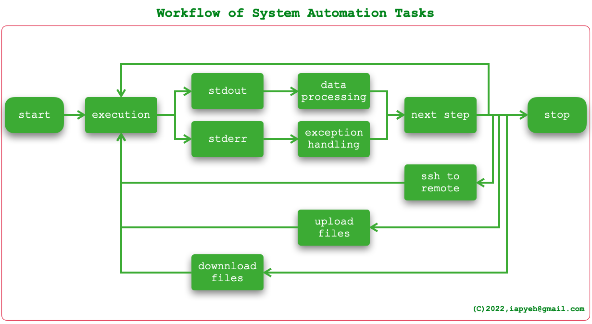
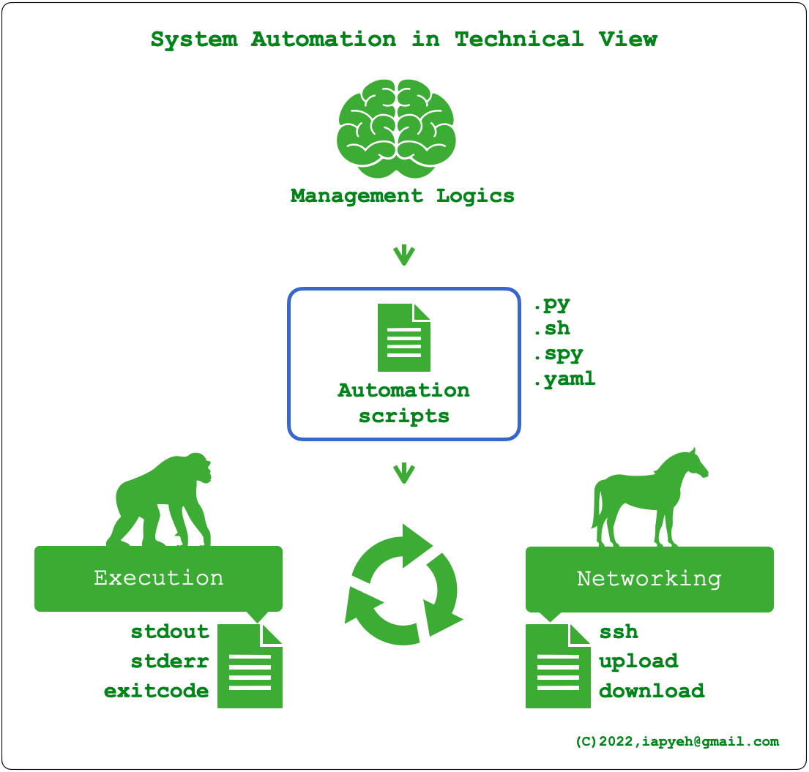
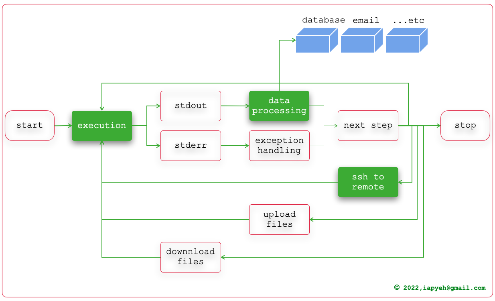
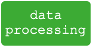
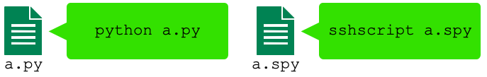
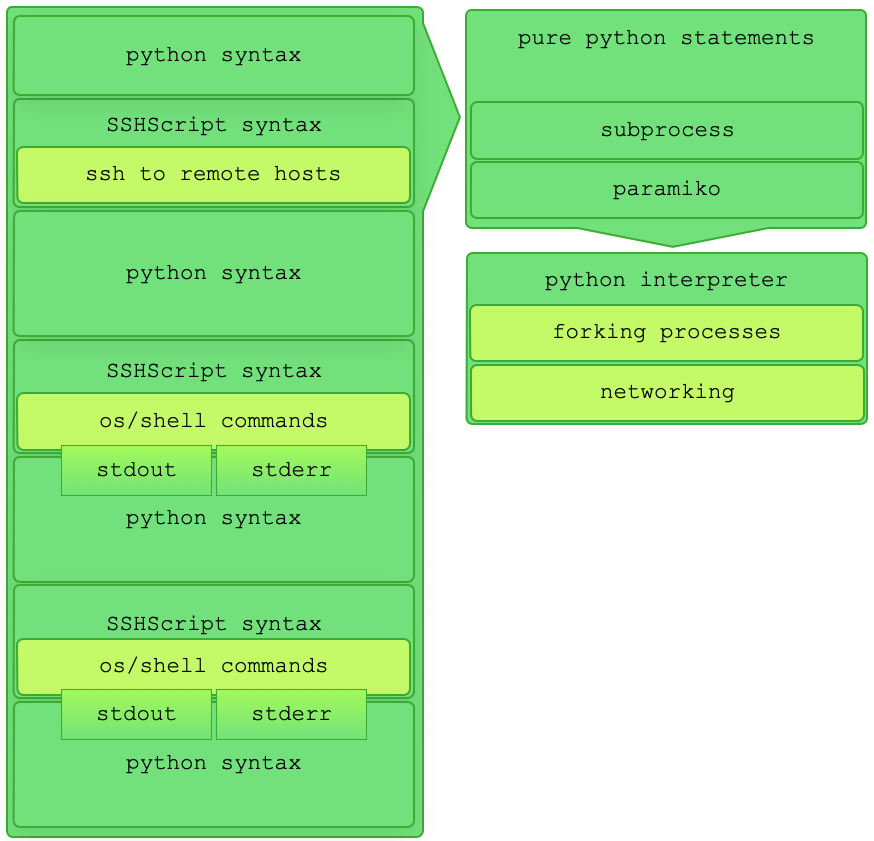

# 用 Python 作系統自動化

# 技術性觀點下的系統自動化

系統自動化是在本機或遠端伺服器上執行一連串的系統指令及Shell指令然後處理指令的輸出。一直重複這樣的過程直到達成目的。如下圖所示。

# 為什麼用Python

一開始，工程師都是手動作業。等到工程師熟悉那些程序會有怎樣的行為為與結果之後，才會將程序自動化。實務上的關係架構如下圖所示。工程師將來自公司主管的任務與指示轉化為「管理性邏輯」，實現那些邏輯可大略分成「執行電腦指令」及「網路連線」兩種行為，將「執行電腦指令」及「網路連線」整合在一起的程式，稱之為「Automation Scripts」(自動化程式）。

有很多種程式語言可以寫系統自動化程式，Python是其中之一，傳統上系統自動化程式之王是shell script，雖然目前寫系統自動化程式的工具很多，但筆者相信hell script在系統自動化領域的王者地位仍屹立不搖。雖然有多種工具互相競爭，然而不同於社會性競爭，系統自動化程式語言之間可以互相串連互助合作。相對於程式語言，還有一種新的Declarative（宣告式）作法，Ansible的YAML屬於這種方式。

[Image credit: nixCraft](https://www.facebook.com/nixcraft/posts/pfbid02b7uUDRR9jZpMzdKMzrVsmxm48PkS4TCDX9hJjiL2fBsGdov6s5FPJEy31zMKwmwKl)

既然有那麼多種選擇，為什麼是 Python? 對於筆者，答案很單純「因為它是Python」。在程式語言中，技術上而言，沒有什麼是只有A做得到而B做不到的事情。差別只在寫程式的速度、執行速度、函式庫數量等無關緊要的差異。網路上有無數的「程式語言比較」，多半只是飯後閒聊而已。如果把大谷翔平帶去籃球場考三分球，或是把林書豪帶去棒球場考接殺外野滾地球，應該就發表好幾篇頭頭是道的論文，把這兩位運動員說成百年難得一見的白癡。為什麼選Python，純粹就是個風格的選擇。何況程式語言是可以互助的，雖然我選擇Python寫自動化程式，但我經常也需要整合shell script, php的程式以完成工作。我比較不考慮YAML。我如果有時間，我寧可用來替程式寫文件，而不是把文件寫得像程式，若要把文件寫的像程式我直接寫程式就好。但這沒有技術性的高低好壞，純就只是風格選擇不同。

# 如何用 Python

且將系統自動化流程分得更仔細些，裡面有三個主要功能：execution(執行指令)、data processing(資料處理)與networking(網路通訊;主要是ssh連線)。 

既然選擇了Python，就有無數的Python package（套件）可以利用，那些Package當中，有些與系統自動化直接相關。基於上述三個功能，我們可以將直接相關的package分成以下兩群：

## 一、執行指令與網路通訊

- [fabric](https://www.fabfile.org/) (based on invoke and paramiko)
- [netmiko](https://github.com/ktbyers/netmiko) (based on paramiko)
- [paramiko](https://www.paramiko.org/)
- [pyinfra](https://pyinfra.com/)
- [plumbum](https://plumbum.readthedocs.io/en/latest/remote.html) (based on paramiko)
- [sshscript](https://iapyeh.github.io/sshscript/index) (based on subprocess and paramiko)

我要感謝[reddit上提供這份清單的人](https://www.reddit.com/r/Python/comments/x9k040/sshscript_integrate_subprocess_and_paramiko_to/)。我相信這不是完整的清單。如果你發現有漏掉什麼，歡迎讓筆者知道。

## 二、資料處理

「資料處理」這件事包含廣泛，可大可小，可能包山包海一輩子作不完，也可能彈指間飛灰湮滅。基本上是工程師看情況而定。然而不論處理程序如何，有一件事無法避免就是從執行結果的非結構化資料得到想要的資訊，作為後續處理的判斷。以下這幾個package可以幫忙把指令輸出的非結構化資料轉成結構化的資料，這件事的功用很大。

- [JSON Convert](https://github.com/kellyjonbrazil/jc) ([jc](https://github.com/kellyjonbrazil/jc))
- [TextFSM](https://github.com/google/textfsm)
- [Template Text Parse](https://github.com/dmulyalin/ttp) ([TTP)](https://github.com/dmulyalin/ttp)

系統自動化這件事，Python的套件是完整的，而且提供工程師有好幾種選擇完成系統自動化的三個主要功能。而且這些套件都是只要有Python在，用 pip 就可以簡單安裝的。功能強大，安裝簡單，安裝完後馬上可以動手寫程式，不需要再讀使用手冊，不需要上補習班。

# SSHScript的特色

接下來是老王賣瓜。當初筆者不知道Python已經有好幾種選擇，只是籠統地知道使用Python處理資料會比使用sed, awk等等來的方便，希望能盡量用Python而不是shell script。其實netmiko, fabric等package都很優秀，然而我希望能夠最大程度取代shell script，使得自動化程序能盡量以Python完成為原則。SSHScript是從這個概念出發，我相信這是SSHScript與其它package不一樣的地方。

SSHScript並不是要取代shell script、os指令或shell 指令，而是讓Python更簡易用於系統自動化。類似Python與C的關係那樣，Python並不是要取代C，而是讓C有更親善的使用方式。常言Python是膠水式程式語言，這是Python的特色與長處。

為了跟一般的python script作區別，內含SSHScript的增添的語法的自動化程式我以 .spy 作為副檔名。以下提到.spy檔案指的都是以sshscript執行的系統自動化檔案。副檔名.spy並非強制規定，它只是一個建議的慣例，任何副檔名，sshscript都可以執行。

## 直接將指令寫在程式中

當我們把一個本來手動進行的程序變成一個自動化程式，在手動執行的時候，我們執行的是OS或sehll的指令與參數。那些指令與參數可能是前輩已經行之多年的作法，當中有許多經驗與智慧的累積，沒有必要在自動化的時候重新發明輪子。在轉成自動化的時候，把所要執行的指令與參數直接寫在自動化程式中，這樣的作法風險低、簡明易懂，避免爭議也容易維護。

事實上，我們在shell script是這樣做的。我希望.spy也是一樣。這是已經有那些Python package可選擇的情況下，筆者依然決定開發SSHScript的原因。

## 加上連線就可以遠端執行

我希望能做到.spy內相同的一段程式碼可以像shell script那樣可在本機執行也可在遠端伺服器上執行。原因是因為在我的應用環境中，遠端伺服器被重重保護著，我要連上遠端伺服器手續繁瑣困難。很多伺服器要跨越超過一層又一層的nested ssh才能完成一個簡單的作業。我是在本機開發，在本機執行測試完成後，不論那部伺服器有多深，只要加上連線的部分就可以在遠端執行，這是我開發SSHScript時設定的目標。

如果能做到上面那一點，以下這一點也是水到渠成：程式原始檔案在不同的主機之間搬來搬去都可以執行（當然，前提是不能hard code參數在程式當中，Python有讀取命令列參數及設定檔的模組可以輕鬆解決這個問題）。

這個特性不但可以不必重新發明輪子，平台互通性提高甚至會改變整個自動化體系的架構。這一特性看似簡單，實際作用卻很大。

## 支援互動模式

有一些指令可以單獨由OS執行，有些指令必須透過shell執行，也些有指令是根據參數不同而定。我們在手動執行的階段通常不容易察覺這個差異。而透過shell執行的指令當中互動是常見的形式，例如 sudo 成root時需要輸入密碼是一個最單純的案例。切換成root身分執行指令是自動化經常需要進行的程序。一個完整的自動化程式一定會遇到這樣的情況，否則必然會產生需要人工介入的斷點，變成不完整的自動化，有時會讓自動化失去意義。

在滿足「直接把指令寫在程式中」的前提下.spy也能夠支援執行這一類型的程式。

## 可處理串流輸出

大部分的指令都有明確的結束。然而，串流式輸出的指令也很常見。例如tcpdump。這個指令可以用來debug，也可以用來抓駭客。如果你想體驗這點，只要在公網上開個VM，然後架設一台SIP伺服器在5060 port上等著連線，一天過後在伺服器執行tcpdump -n port 5060，你就能體驗到如過江之鯽的攻擊。其實你不必太擔心，就算你什麼都沒作，一天下來也能擋掉十幾萬那種攻擊。但如果你正在上面debug，那些攻擊產生的雜訊會使得debug變得很困擾。此時你會想要利用tcpdump的資訊將那些不請自來邀請通話的IP全部挑出來，然後丟給iptables（本機防火牆）處理，那時候你就會需要「處理串流輸出」的功能。

一樣地，在滿足「直接把指令寫在程式中」的前提下.spy也作到了可執行串流輸出程式的功能。

# SSHScript是怎麼運作的

SSHScript提供一組SSHScript Syntax的語法，讓你在python script當中嵌入shell 指令或os指令，這套語法也讓你指定指令輸出(stdout, stderr)的處理方式。你直接將檔案存檔為.spy檔案後，使用sshscrpt直接執行，就像是執行一般Python程式那樣。sshscript是當你用pip安裝時SSHScript所產生的CLI(可執行檔)。

SSHScript會將你內嵌在.spy當中的shell 指令或os指令改寫成pure python程式碼，然後就像是一般的Python程式那樣執行。

# 結語

1. 用程式語言在作系統自動化早已行之多年，shell script是最多也最常見的工具。
2. SSHScript是一種基於Python的程式自動化工具，它能讓使用者像是寫shell script那樣直接把shell 或 os 指令寫在程式當中，並且像shell script那樣直接在本機執行或者加上連線之後在遠端伺服器上執行，使用者不需處理呼叫subprocess與paramiko的細節。
3. 在執行指令之後的資料處理階段，使用SSHScript能同時使用數以萬種的Python的package，尤其是那些能將執行指令產生的非結構化資料轉成結構化資料的那些package（例如 json convert)。這是使用SSHScript比使用shell script方便的地方。

如果你在找尋一種可以兼具shell script與Python優點的自動化程式工具，那就是SSHScript。