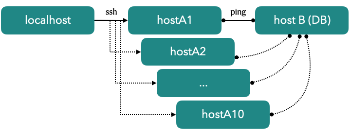

<div style="text-align:right"><a href="./index">Back to Index</a></div>


## Using ping to check network quality
Server group A has members A1, A2, ..., A10, which share the same database server B. 
You want to regularly check the connection states from group A to B. 
This example shows how to connect to all servers in group A and execute the "ping" command to database server B.

```
## filename: example-ping.spy
databaseServer = '192.168.1.100'
## suppose they share the same credentials
username = 'user'
password = '1234'
groupsA = []
for i in range(10):
    groupsA.append([f'{username}@hostA{i+1}',password)
## This keeps average speeds of "ping"
states = {}
for account,password in group:
    with $.connect(account,password) as host:
        $f'ping -c 3 -W 3 {databaseServer}'
        ## find the bottom line of output
        ## eg. 3 packets transmitted, 3 received, 0% packet loss, time 2003ms
        if 'transmitted' in line:
            words = line.split()
            received, time = int(words[3]),words(cols[9][:-2])
            avg = sum(times)/len(times) if len(times) else 0
            states[account] = time / received if received else 0
```



#### Executing 
```
$sshscript example-ping.spy
```