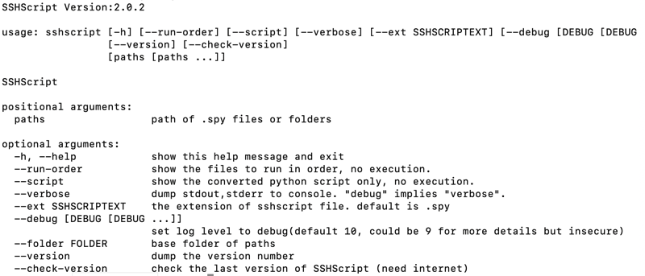

# SSHScript v2.0 Getting Started (Draft)

Last Updated on 2023/10/21

<div style="text-align:right;position:relative;top:-140px"><a href="./index">Back to Index</a></div>

## Topics

## 🔵 Installation
```
    pip3 install sshscript
    ## or
    python3 -m pip install sshscript
```

## 🔵 Upgrading
```
    pip3 install sshscript --upgrade
    ## or
    python3 -m pip install sshscript --upgrade
```
    
## 🔵 <a name="check-installation"></a> Checking if SSHScript is Installed

Once you have installed SSHScript, you can check if it is working by running the sshscript command in a terminal.

```
$ sshscript
```

If SSHScript is installed correctly, you will see a screen like this:



If you do not see this screen, you may need to modify your shell's PATH environment variable to include the path to the SSHScript CLI. You can find the path to the SSHScript CLI by running the following command:

```
$ python3 -c 'import sysconfig; print(sysconfig.get_path("scripts"))'
```
Once you have the path to the SSHScript CLI, you can add it to your PATH environment variable. For example, to add the path to your PATH environment variable in Bash, you would run the following command:

```
export PATH=$PATH:/path/to/sshscript
```

For example
```
$ python3 -c 'import sysconfig; print(sysconfig.get_path("scripts"))'
/opt/homebrew/Cellar/python@3.8/3.8.18/Frameworks/Python.framework/Versions/3.8/bin
export PATH=$PATH:/opt/homebrew/Cellar/python@3.8/3.8.18/Frameworks/Python.framework/Versions/3.8/bin
```
## 🔵 <a name="check-works"></a>  Dollar-Syntax and Python Module

SSHScript can be used in two ways: dollar-syntax and Python module.

### SSHScript Dollar-Syntax

SSHScript dollar-syntax adds additional syntax to regular Python statements. This syntax is called dollar-syntax because it starts with a dollar sign ($).

Python scripts with dollar-syntax are executed by the SSHScript CLI command sshscript.

For example, the following two-line script executes the command hostname and prints the output to stdout:

```
$hostname
print($.stdout.strip())
```

To run this script, save it as example.spy and then run the following command in a terminal:

```
sshscript example.spy
```

Conventionally, SSHScript dollar-syntax scripts are named with the .spy extension, but this is not required.

### SSHScript Module

SSHScript v2.0 has improved the functionality of the SSHScript module for users who want to use SSHScript without writing dollar-syntax. The SSHScript module is also easier to use when integrating with existing projects.

For example, the following Python script executes the command hostname and prints the output to stdout:

```
import sshscript
session = sshscript.SSHScriptSession()
session(hostname)
print(session.stdout.strip())
```

To run this script, save it as example.py and then run the following command in a terminal:

```
python3 example.py
```

### Difference Between SSHScript Dollar-Syntax and Module

Functionally, SSHScript dollar-syntax and the SSHScript module can do the same things. However, from a code readability perspective, SSHScript dollar-syntax is more similar to shell script, while the SSHScript module is more implicit but less elegant.

Which Should You Use?

Which method you choose to use depends on your personal preference and the needs of your project. If you are familiar with shell scripting and want to write scripts that are close to shell scripts, then SSHScript dollar-syntax is a good choice. If you are more comfortable with Python and want to write scripts that are easy to integrate with existing Python projects, then the SSHScript module is a good choice.
