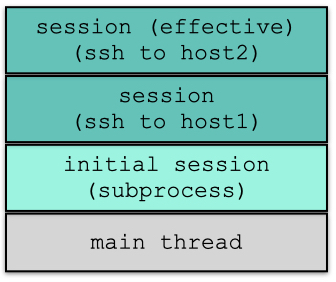

# SSHScript 2.0 Tutorial
# SSHScript and Threading (Draft)

Last Updated on 2023/10/20

<div style="text-align:right;position:relative;top:-200px"><a href="./index">Back to Index</a></div>

## Topics

- [Every thread has an effective SSHScript session](#effective_session)
- [Let functions come into play](#functions)
- [Let Threads come into play](#threads)
- [session.bind(),session.thread(): Binding a session to threads or functions](#bind)

##  🔵 <a name="effective_session"></a> Every thread has an effective SSHScript session



The initial session (an instance of SSHScriptSession) is created for the main thread. All commands executed by the initial session are executed on the localhost using the subprocess module. This includes one-dollar, two-dollar, with-dollar commands as well as dollar properties, such as $.stdout, $.stderr and $.exitcode.

For example, the following command would be executed by the subprocess module:

```
$hostname
```
This is because the effective session is the initial session of the main thread.

If the initial session is connected to a remote server, a new SSHScriptSession instance is returned by the $.connect() method. This new session becomes the effective session of the main thread.

For example, the "hostname" command would be executed by the Paramiko module:
```
with $.connect('user@remotehost'):
    $hostname
```
This is because the effective session is the new SSHScriptSession instance returned by $.connect().

SSHScript attaches every dollar-command to a session to execute it. To do this, SSHScript binds a session to every thread. This session is the effective session of the thread.

Every thread carries a stack to hold sessions. Initially, the stack of the main thread has one element: the initial session.

When a new connection is created, a new session is created and placed on top of the stack to become the effective session. This session is removed from the stack when it is closed.

```
## For example, the following code would execute the commands on localhost using the subprocess module:
$hostname
$whoami

## Then, the new session becomes the effective session of the main thread:
with $.connect('user@remotehost'):
    $hostname
    $whoami

## Finally, the initial session would execute the commands on localhost using the subprocess module again:
$hostname
$whoami

## This is because the connection to the remote host is closed.
```

## 🔵 <a name="lastsession"></a>The last connection made is the effective session

SSHScript 2.0 supports a session connects to multiple hosts at the same time.
When connecting to multiple hosts, the effective session is the last connection made.

Here is an example.
```
def get_hostname():
    $hostname
    return $.stdout.strip()

localhostname = get_hostname()
 
## connect to the bridge host 
$.connect('user@bridge1')
$.connect('user@bridge2')
$.connect('user@bridge3')

## the effective session is the last connection made.
hostname = get_hostname()
assert  hostname == 'bridge3'

## close the seession to bridge3
$.close()

## the effective session is now the bridge2
hostname = get_hostname()
assert  hostname == 'bridge2'

## close the seession to bridge2
$.close()

## the effective session is now the bridge1
hostname = get_hostname()
assert  hostname == 'bridge1'

$.close()
## this would be localhost's hostname
assert localhostname == get_hostname()

```

##  🔵 <a name="functions"></a>Let functions come into play

Usually we got so many runtines to execute on many hosts.
We could use functions to do the same thing on every host.
By updating the function, it applies to all hosts.

Here is an example:
```
def get_date():
    $date
    profile = {'dat':$.stdout.strip()}
    return profile

profile = {'localhost':get_date()}
accounts = ['user@hostA','user@hostB']
for account in accounts:
    with $.connect(account):
        profile[account] = get_date()
```

##  🔵 <a name="threads"></a>Let Threads come into play

For some reason that we would use thread.

Here is an example:
```
def get_date(profile):
    $date
    profile['date'] = $.stdout.strip()

def get_diskspace(profile):
    $df
    profile['df'] = $.stdout.strip()

def connect(account,profile):
    with $.connect(account) as remote:
        $hostname
        hostname = $.stdout.strip()
        profile[hostname] = {}
        get_date(profile[hostname])
        get_diskspace(profile[hostname])

profile = {}
accounts = ['user@hostA','user@hostB']
threads = []
for account in accounts:
    thread = $.thread(target=get_profile,args=[account,profile])
    thread.start()
    threads.append(thread)
for thread in threads:
    thread.join()
print(profile)
```

In the above example, the "get_date()" and "get_disksapce()" functions were called by different threads.
It is fine because the effective session of threads are different.

##  🔵 <a name="bind"></a>session.bind(),session.thread(): Binding a session to threads or functions

When a session is connecting to multiple hosts, the effective session is the last connection made.
What if you want to execute commands on previous connecting sessions?
That is why "session.bind()" comes into play.
The effective session of a thread or a function could be arbitrary assigned by "session.bind()".

Here is an example.
```
def get_hostname():
    $hostname
    return $.stdout.strip()
    
def get_date(profile):
    $date
    profile['date'] = $.stdout.strip()
    return profile

def zone_job(accounts,zoneprofile):
    for account in accounts:
        with $.connect(account):
            get_date(zoneprofile)

profile = {'zone1':{}, 'zone2':{}, 'zone3':{}}
## these hosts are behind bridge1
accountsZone1 = ['user@zone1HostA','user@zone1HostB']
## these hosts are behind bridge2
accountsZone2 = ['user@zone2HostA','user@zone2HostB']
## these hosts are behind bridge3
accountsZone3 = ['user@zone3HostA','user@zone3HostB']

## connect to the bridge host 
bridgeSession1 = $.connect('user@bridge1')
bridgeSession2 = $.connect('user@bridge2')
bridgeSession3 = $.connect('user@bridge3')

## the effective session is the last connection made.
hostname = get_hostname()
assert  hostname == 'bridge3'

## session.bind(func) returns a new function
## that calls func() by taking bridgeSession1 as its effective session.
hostname = bridgeSession1.bind(get_hostname)()
assert  hostname == 'bridge1'
hostname = bridgeSession2.bind(get_hostname)()
assert  hostname == 'bridge2'

## the effective session of thread1 is the last connection made (aka. bridgeSession3)
thread1 = threading.thread(target=zone_job,args=[accountsZone1,profile['zone1']])
## session.bind(thread) would set the binding session to be the effective session of this thread
bridgeSession1.bind(thread1)

## session.thread() is a handly function for doing the same thing.
thread2 = bridgeSession2.thread(target=zone_job,args=[accountsZone2,profile['zone2']])

## the effective session of thread3 is the last connection made (aka. bridgeSession3)
thread3 = threading.thread(target=zone_job,args=[accountsZone3,profile['zone3']])

thread1.start()
thread2.start()
thread3.start()
thread1.join()
thread2.join()
thread3.join()
bridgeSession1.close()
bridgeSession2.close()
bridgeSession3.close()
print(profile)
```
